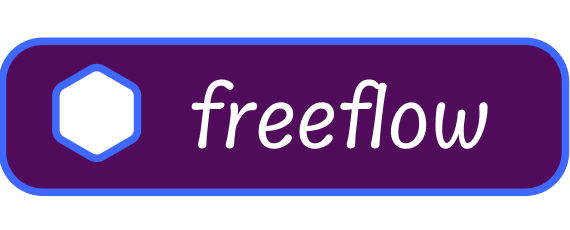

<b style="font-size:25px;text-align:center">🩵⚡️ decentralised collaboration.&nbsp;</b>
<b style="font-size:25px;text-align:center">💬👩‍🔬 But next generation. </b>

<h1>🤔🗽 what does FreeFlow mean ?</h1>

><mark>`free flow of information`</mark> is a 👩‍⚖️ western term which means that any person or persons and/or any organisation/s can own and operate any media or  information agency, 🗞️ gather any information and 🔉 disseminate the same, if they so desire , to any target audience, wherever and whenever they want. 🗽

The main idea behind "FreeFlow" is to help the free flow of information.

> The essence of free speech is the ability to think and speak freely and to obtain information from others through publications and public discourse without fear of retribution, restriction, or repression by the government.

the same idea as what I said has turned into action many times. for example look at these 2 powerful examples: Wikipedia and Twitter. they both provide a place to share data (mostly as text) almost 100% free of restrictions & by anyone. there are many other examples each targeting a particular kind of audience. we respect them all and not gonna be a duplication.

we are going to fill the gaps we have found in those platforms and provide the idea with a new taste and mindset. it's exactly what forking an idea means. keep reading to learn about the problems it solves and its benefits. 

 
before disscussing about problems we have found and tried to solve, lets simply say what we have in common. 
<h1>🧸🦄 exact tools we offer now</h1>

- <b>📝 Writings :</b> just like any other `note taking` and `text editing` platform you can write down and share your 💭 thoughts by writing, drawing tables, having ✅ checkboxes and more.
- <b>🙋‍♀️ Asks :</b> 3 type of `🤔 question` can be asked the audience.
    - ✅ multiple choice test,
    - ✍️ text answer
    - and 🗳️ polls.
    
    there are many useful use cases for this unit that will be inclued in `real life use cases` section of here.
- <b>🗂️ Resources :</b> most probably you've used ☁️ cloud storage services before. <mark>it shares basic functionality with them</mark>, where you can upload files by drag and drop and access them from multiple devices of your own or sharing them with others simply with a url.  you can also use 📃 `PDFs`, 🎧 `audios`, 🌁 `images` and 📽️ `videos` directly from the application without even downloading. <mark>but it exists there becuase of its role in our forked application. its described right after this section.</mark>
- <b>📂 packs :</b> just like the folders in any operating system of your choice where you have folders to keep everything organized, you can put other units inside a pack and it can also be inside another pack. `use any level of nesting a clean file hierarchy needs`

<b>💡 📦 each of them is a "unit" </b>

<b>👩‍🔬 🧑‍💻 collaboration :</b> each unit is kept isolated from the others and has its own access levels. you can assign any number of 👩‍💼 users each with a certain access level. everyone who has write access to something can make chagnes to that.
 
 

<b>💬 forums :</b> each unit has a 📝 conversation box under it which can be used to just share thoughts or asking a question about that unit or ... . just like the concept of comments of 👩‍💻GitHub issues.

<b>🔋 power of combination.</b> units can be used together. for example a 📽️` short video` is a very nice way to communicate with your teammates about something you both are working to solve. it can be uploaded as a 🗂️` Resource` and be referenced inside a message.` as easy as it seems!`
 
<h1>🤔 what benefits do we offer ?</h1>

its time to discuss the `problems` we wanna solve and providing a `comparison` with alternatives. 
 
 
<b>🕰️ 🧙‍♂️ Time Machine</b>
  
always keep track of changes instead of keeping latest chagnes. <b>no overwrite at all ! </b>. <mark>it means we exactly know what is happening now and has happened before all over the network.</mark> it enables a set of features such as the awesome <b>"Time Machine"</b> ! you can go back in time  to match any previous state of anything you want. also <mark>human readable interpreted timelines</mark> are available.

so any time you delete something, it will not actually delete. just another 📝`transaction` says that thing is gone. so dont be worried about mistakenly deletions at all any more.
 
 

<b>🔓 🗝️ Free. Open. from people, for people</b>
 
FreeFlow means the code and the content generated by people are both completely open and free to use.

- <b>👮 🪪 security: </b> you can exactly know what is running on your device. zero percent of doubt is remaind it terms of your content's privacy and security.
- <b>👩‍💻🧑‍💻 community power: </b> unless something like our project exist, the ownership of tools we use everyday will belong to big companies 🤑 . we will need to 💸 pay and worse than that we are limited to their opinions 😠😂 . we must get back the `public ownership` of our frequently used tools. 
    - <b>code: </b> with the code being available publicly, <mark>anyone can review, test, devlop or make a suggesion.</mark> this will make a polished and battle tested application which pleases any taste. read 👾 `extensibility` section below to see awesome <mark>security</mark> and <mark>customization</mark> benefits. 

    - <b>✍️ 🔉 content generating:</b> people can do incredible things together 🤯.
    there are many existing ☁️ platforms trying to host information. though each of them has tried to fill an area with information lack but still there are ♾️ <mark>unlimited untouched areas to fill.</mark> we want to ,help addressing issues like these :
        - 😭 some data even doesnt exist free and publicly 
        - 🏴󠁧󠁢󠁥󠁮󠁧󠁿 does exist but in a single language
        - ⚒️ needs correction or is uncompleted. so it can be improved 
        - 🤓👨‍🎨  is opinionated : people have different thoughts and perspectives. we dont want to unify their thoughts all like what Wikipedia does.
        - 💸 many cources and ... need payment or run annoying ads.

        an example of not existence can be 👩‍🎓`university` in my country where we dont have a complete archive of documentations, 📹 short videos exaplaning something hard to understand by a student, 🙋‍♀️ questions, etc. 

        and for non-existence : even though we have a lot of programming tutorials, they are only available in 🏴󠁧󠁢󠁥󠁮󠁧󠁿 English or most used languages at best 🙍‍♀️. 

    
        💵 its time to replace buying books, online cources, or paying for educational media. even if a tutorial exists in a website with a thousand annoying ads ...
  
> Jadi Mirmirani always says these kinds of freedom will shape a better world 🌎 ... 

so lets be positive to internatioal society 🙂💕 !

<b>🕰️⚡️ realtime sync:</b> by using power of websockets and React we keep the UI always reflecting the most edge changes of the network 🥳. when this is added to awesome compressings and caches solutions, always the data you wanna be updated with is sit locally inside your device 🧘‍♀️ . so any computation such as filtering or sorting is done instantly ⚡️ . no more reloads. no more loadings. also no more save button. isn't it wonderful that it just works 🥰 ...?!
 
 
<b>🤩 👾 being extensible in every aspect.</b> 
do you remember i told you anyone can customize the source code for him/herself ? you can also do the customisation in runtime level 😬💪🙂 . i mean, think of a running server somewhere which is serving an instance of our platform; you can :
- <b>retrieve data from API.</b> you can subscribe to data changes or just get them all at once. then you can 
    - 💅 show it in a UI that you have built from scratch for example for any OS ( 📱 or 🖥️ ).
    - 🗂️ use it as a backup file to make sure nothing's gonna be lost.
    - 📈 do computations and analyzations on existing data; for example charts can be drawn from long time calendar data.
    - 🛸 anything else ...
- <b>uploading any data structure :</b> you can upload <mark>whatever data you need</mark> to an existing server (we call them `remotes`). dont waste time maitaining your own infrastructure. 
    - `authentication`, 
    - `memory caches`, 
    - `json special ref pointers`, 
    - `concurrency locks`, 
    - `xz compression`, 
    - `websockets & realtime sync` 
    - `access levels system`, 
    
     and much more are already done for you at this very moment of writing ! just focus on what you wanna make work.
    
    just an instance an awesome feature it enables, <mark>is that you can encrypt your data using whatever encryption algo you want.</mark> will there be any chance of security issues 🤯🤟 ...?!
 
 

<b>🌎 internationality : </b>
pInternationality is a part of the platform's `🧬 DNA`. so any content written in any language must be available in other languages and this translation is done by 🤖🦾 `machine learning powered` translation tools. it includes any content written by users :  written 📝 writings, 💬 people disscussions, etc. so if you want to communicate with someone who doesnt know you language, it doesnt need to necessarily happen in a common language. you type in your own language as same as they do. translation layer takes care of the rest 🤯 🤩 . 

of course application UI and calendars are also available in those languages 🙂

now these languages and calendars below are finalized to be the starting point.
- 🌎 English lang
- 🌎 Persian lang
- 📆 solar Hijri
- 📆 Arabic Hijri
- 📆 Gregorian

😤 there is another point to mention : this project doesn't belong for example to a US company. when i opened Notion for the first time it clearly said we can not provide any service to you because of $$cking sanctions against your country.
💵 also Notion and its alternatives like EverNote offer premium plans but they are expensive for a personal user who doesnt get paid in us dollar.
💳 in addition to that someone from for example Iran has not credit card to pay for it even if it worths. 
🗺️ persian language and 📅 calendar are not supported, etc ... 

<b>💄 💅 User Exprience (UX) :</b> 
- <b>⚙️ stability: </b> we want our platform to be as stable as it can be. 
    - 🧪 testing everything well, 
    - 🐾 tracking issues, 
    and taking 🐛 bug reports seriously.
   
    🤔 💭 think of an application which any of its parts has been 🧪 tested many times with any possible situations in mind... 🤓
 

- <b>🤑 ⚙️ stable but feature rich: </b> some platforms which want to keep their platform stable, are `🐌 too slow` in adding new features because they say stabilisation takes time ⏰. i hope we are not going to be like them!😬 but if possible.
 
 
- <b>❤️‍🩹 💖 its all about feelings: </b> we are living to feel something `🐣 new`, `🫐 fresh` and `🥰 awesome`. its not enough to have a stable and feature rich application that only `👩‍🔬 experts` can take advantage of. we wanna every part of it to make user feel extremely well 🤤. `well thought 👨‍🎨 designs` and use of user friendly `animations` makes it sweet and easy to use ! think of an elevetor. many many things must work properly in order to it working as expected. but end user has nothing to do with complex stuff. he/she just uses the device by pressing a single button and everything just works 🤩 ... as an end user you must be able to do whatever you wanna do quicly and in a convenient way and only go beyond of that if you want (using APIs and ...). also your 💭 feedbacks will be the way that using that we find out what you like and what you dont.
 
 
- <b>😢 🔮 Error handling: </b> even if everything is 🧪 tested, there will be a chance of that something go wrong 🙍‍♀️. in that case, instead of showing annoying alerts like "Something went wrong", we design our application in a way that informs the user what has gone wrong and gives him a way to track the issue until its addressed 🐾.

<b>👩‍💻  🖥️ Developer Exprience (DX) : </b> we will constantly try to improve code's readability and how to use 📃 documentations. we really want to make it sweet for `developers` to work with code, as much as we wanted for end users.

<b>🤔 comparison with simliar platforms: </b>before introduction of <mark>`Assistant`</mark>, think of differences of Telegram and WhatsApp. they have many features in common. both of them are messaging platforms with hundereds of milions of users. even though they are both like each other but they target two different target audience. WhatsApp is not meant to be used as an archive or to manage super large groups. it's mainly designed to replace traditional SMS and Phone Calls. it's obvious, because it doesnt offer a huge cloud storage which keeps everything forever. in contrast Telegram does offer the cloud storage, super groups, super channels, etc . so its not about being better. each of them meets an specific need. lets continue with Telegram, its far more better than WhatsApp to keep archives. our university's library is currently using it to upload book files. but it's not really designed to do that. news in a super group can easily go far away and lost in short time. its search system doesnt use a full text search engine. you may think of WikiPedia and say why you dont talk about that. WikiPedia is that exact space designed for people so they can complete something freely and by little contributions. its great but it also sucks in those problems mentioned in `content generating section` in this writing. i think its now clear what our platform have to offer. 

<b>🤖 👾 Unified Assistant:</b> is a powerful text interface which reacts to your text queries by showing you filtered search results and help FAQs. it can also be used to command something. using existing commands you can for example tell it to sort results of this page by time or mark all notifications as read, etc  - it also suggests queries which may help you in what you're doing at the moment.

<b>convenient cross platform and beyond: </b> in addition to our web application you can install the application on your machine. whether desktop or mobile:
- <b>Desktop: </b> using electron js we publish the same web code base as an installable application for windows, mac os, and linux. you most probably have used an application using the same build process : Vs code, Discord, Figma desktop,whatsapp desktop, etc ... 
- <b>Mobile:</b> our frontend is build on top of react and Js. using ReactNative we have plan to publish Android and Ios installable apps. track the progress in issues.
- <b>web browser extension:</b> it's a shortcut to turn any selection into a new note just by one click.

Coming Soon : there can be extra optimizations in dekstop and mobile applications; like disk caches and native platform's features.  

<h1>🤖 🤗 real life & awesome use cases</h1>
🔜 this part is planned to be done soon.

 
 
<h1>🙋‍♀️ how can i contribute ?</h1>
to read more about how our team work is done here, please take a look at this guide : 
 
 

[contribution guide](./contribution_guide.md)
 
 
<h1>🧑‍💻 🖥️ setting dev environment</h1>
you can find out details here : 

[development guide file](./development_guide.md)
 
<h1>💸 donation</h1>

for now we `dont` have a paypal or something to get donations.
maybe someday we open such accounts <mark>but for now help us through improving the code.</mark> (take a look `"at how can i contribute"` part )
 
 

